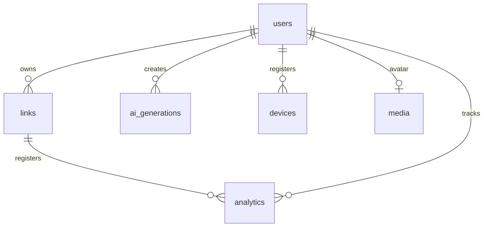

# 🚀 LinkCraft AI - Backend API

[](https://nestjs.com/)
[](https://www.typescriptlang.org/)
[](https://typeorm.io/)
[](https://www.postgresql.org/)
[](https://supabase.com/)
[](https://sdk.vercel.ai/)
[](https://cloudinary.com/)
[](https://www.brevo.com/)

A powerful, high-performance NestJS RESTful API acting as the engine for **LinkCraft AI**—a complete AI-powered Link-in-Bio platform. This service handles dynamic AI bio streams, click tracking & session analytics, cloud media storage, user/admin multi-session authentication, and email dispatching.

---

## 🏛️ Project & Monorepo Context

LinkCraft AI is structured as a modular suite of three independent applications:
1. **`backend` (This Service)**: NestJS REST API with TypeORM & Supabase PostgreSQL.
2. **`user-panel`**: React + Vite Single Page Application for user profile configurations.
3. **`admin-panel`**: React + Vite Single Page Application for administrative analytics and management.

---

## ✨ Features & Architecture

### 1. Robust Core & Security
*   **NestJS Architecture**: Leverages TypeScript, dependency injection, and modular structure for extreme maintainability.
*   **Production-Ready Security**: Implements `helmet` for secure HTTP headers, precise CORS configurations for distinct frontend clients, and global rate limiting via `@nestjs/throttler` (100 requests per minute).
*   **Strict Validation**: Employs global NestJS `ValidationPipe` with `whitelist` and `forbidNonWhitelisted` options to sanitize and type-check payloads.

### 2. Authentication & Session Management
*   **Dual Authorization Guards**: Features access & refresh token rotation patterns built on `@nestjs/jwt` and `@nestjs/passport` (`JwtAuthGuard`, `JwtRefreshGuard`).
*   **Device & Session Tracking**: Tracks active sessions within a `devices` database table, allowing users to view, monitor, and selectively revoke active login sessions.
*   **Secure Admin Access**: Integrates `argon2`-based password verification and dedicated admin guards to protect sensitive metrics and control operations.

### 3. Dynamic AI Bio Generation
*   **Vercel AI SDK & GROQ**: Streams optimized user bios utilizing the high-performance `llama-3.3-70b-versatile` model.
*   **Flexible Inputs**: Generates bios customized by professional context, active link details, tone of voice (`professional`, `casual`, `humorous`, `minimalist`), and length constraint (`short`, `medium`, `long`).
*   **Usage Control**: Applies custom rate limiters and tokens usage auditing to control and log generation costs.

### 4. Advanced Link Layouts & Management
*   **Layout Utilities**: Complete CRUD endpoints to manage custom social cards, video embeds, portfolios, store links, and custom redirects.
*   **Drag-and-Drop Order Engine**: Supports dynamic sorting via order indices (`orderIndex` updates) and atomic reordering operations.
*   **Bulk Actions**: Perform atomic batch updates (toggle active state, assign categories, or delete multiple links).
*   **Scheduled Access**: Embeds schedule intervals (`scheduleStartAt`, `scheduleEndAt`) to make links active only during specific time windows.

### 5. Time-Series Analytics & Unique Click Fingerprinting
*   **Client Fingerprinting**: Performs unique click detection by hashing browser headers, IP addresses, and user-agent strings.
*   **Device Parsing**: Automatically resolves device type (`desktop`, `tablet`, `mobile`), browser type, and operating system of incoming traffic.
*   **Aggregated Analytics**: Features performance monitoring with overview aggregations (`totalProfileViews`, `clickCount`, time-series distributions).

### 6. Cloud Storage & Transactional Mailers
*   **Media Storage**: Integrated with Cloudinary and NestJS Multer to support single and bulk image uploads for avatars, icons, and link thumbnails.
*   **Transactional SMTP**: Connects to the Brevo HTTP API to guarantee high-deliverability of system emails (verification links, password reset tokens) using asynchronously compiled HTML templates.

---

## 🗄️ Database Entity Models

The PostgreSQL schema is managed through **TypeORM** with the following models:



### 1. `User` (`users` table)
Stores profile credentials, themes, statistics, and billing configurations.
*   **Key Fields**: `email`, `passwordHash`, `username`, `displayName`, `profession`, `bioText`, `plan` (FREE, PRO, ENTERPRISE), `role` (USER, ADMIN), `themeSettings` (JSONB containing color templates & fonts), `totalProfileViews`.

### 2. `Link` (`links` table)
Stores the catalog of active user-generated redirections.
*   **Key Fields**: `url`, `title`, `description`, `iconUrl`, `thumbnailUrl`, `linkType` (SOCIAL, CUSTOM, MUSIC, etc.), `category`, `orderIndex`, `clickCount`, `scheduleStartAt`, `scheduleEndAt`, `isFeatured`.

### 3. `Analytics` (`analytics` table)
Captures granular visitor information for profile views and link click events.
*   **Key Fields**: `eventType` (PROFILE_VIEW, LINK_CLICK), `userAgent`, `referrer`, `countryCode`, `deviceType`, `browser`, `os`, `ipHash` (fingerprint), `sessionId`.

### 4. `AiGeneration` (`ai_generations` table)
Logs OpenAI/Groq API prompts, outputs, and cost accounting.
*   **Key Fields**: `prompt`, `response`, `model`, `tokensInput`, `tokensOutput`, `costUsd`, `tone`, `length`, `status`, `wasApplied`.

### 5. `Device` (`devices` table)
Monitors currently authorized access/refresh token configurations per device.
*   **Key Fields**: `accessToken`, `refreshToken`, `expiresAt`, `deviceInfo`, `lastUsedAt`.

### 6. `Media` (`media` table)
Keeps records of public assets hosted on Cloudinary.
*   **Key Fields**: `publicId`, `originalName`, `mimeType`, `sizeMb`, `extension`, `secureUrl`.

---

## 🚦 API Endpoint Reference

All REST endpoints adhere to strict schema structures:

### 🔐 Authentication (`/auth`)
| Method | Endpoint | Protection | Description |
| :--- | :--- | :--- | :--- |
| `POST` | `/auth/register` | Public | Register a new user account |
| `POST` | `/auth/login` | Public | Authenticate password and return tokens |
| `POST` | `/auth/refresh` | `JwtRefreshGuard` | Rotate access & refresh JWT tokens |
| `POST` | `/auth/logout` | `JwtAuthGuard` | Revoke specific session refresh token |
| `POST` | `/auth/logout/all` | `JwtAuthGuard` | Revoke all other active sessions |
| `GET` | `/auth/sessions` | `JwtAuthGuard` | Fetch active user sessions & device details |
| `POST` | `/auth/forgot-password` | Public | Send password reset token email |
| `POST` | `/auth/reset-password` | Public | Submit new password using reset token |
| `POST` | `/auth/change-password` | `JwtAuthGuard` | Manually update user password |
| `GET` | `/auth/check-username` | Public | Check if a username is available |

### 👤 Users (`/users`)
| Method | Endpoint | Protection | Description |
| :--- | :--- | :--- | :--- |
| `GET` | `/users/profile` | `JwtAuthGuard` | Get authenticated user profile details |
| `PATCH` | `/users/profile` | `JwtAuthGuard` | Update user metadata, profession, themes |

### 🔗 Links (`/links`)
| Method | Endpoint | Protection | Description |
| :--- | :--- | :--- | :--- |
| `POST` | `/links/create` | `JwtAuthGuard` | Add a new redirect link to the profile |
| `PATCH` | `/links/update` | `JwtAuthGuard` | Update link metadata, description, or icons |
| `DELETE`| `/links/delete` | `JwtAuthGuard` | Delete a specific link |
| `POST` | `/links/restore` | `JwtAuthGuard` | Restore a previously deleted link |
| `GET` | `/links/details` | `JwtAuthGuard` | Fetch details of a single link |
| `GET` | `/links/list` | `JwtAuthGuard` | List all links belonging to active user |
| `POST` | `/links/reorder` | `JwtAuthGuard` | Atomically resort the ordering of links |
| `PATCH` | `/links/toggle-status` | `JwtAuthGuard` | Toggle active visibility of a link |
| `POST` | `/links/bulk-operation` | `JwtAuthGuard` | Batch delete or categorize multiple links |
| `GET` | `/links/public` | Public | Fetch links for a public username |

### 🧠 AI Assistant (`/ai`)
| Method | Endpoint | Protection | Description |
| :--- | :--- | :--- | :--- |
| `POST` | `/ai/generate` | `JwtAuthGuard`, `AiLimit` | Start structured bio generation event stream |
| `GET` | `/ai/history` | `JwtAuthGuard` | Fetch past generated bios |
| `POST` | `/ai/apply` | `JwtAuthGuard` | Apply a generated bio directly to profile |

### 📊 Analytics (`/analytics`)
| Method | Endpoint | Protection | Description |
| :--- | :--- | :--- | :--- |
| `POST` | `/analytics/track` | Public | Record page view or click event |
| `GET` | `/analytics/link` | `JwtAuthGuard` | Fetch click performance for a link |
| `GET` | `/analytics/overview` | `JwtAuthGuard` | Fetch system dashboard metrics aggregation |

### 📂 Cloud Storage (`/storage`)
| Method | Endpoint | Protection | Description |
| :--- | :--- | :--- | :--- |
| `POST` | `/storage/upload` | `JwtAuthGuard` | Upload single file to Cloudinary |
| `POST` | `/storage/upload/bulk`| `JwtAuthGuard` | Upload multiple files (max 10) |
| `DELETE`| `/storage/file` | `JwtAuthGuard` | Delete asset from Cloudinary |
| `GET` | `/storage/download` | `JwtAuthGuard` | Generate temporary download/access URL |

### 🛡️ Administration (`/admin`)
| Method | Endpoint | Protection | Description |
| :--- | :--- | :--- | :--- |
| `POST` | `/admin/auth/login` | Public | Authenticate administrator credentials |
| `POST` | `/admin/auth/logout` | `JwtAuthGuard`, `Admin` | Terminate administrator session |
| `GET` | `/admin/dashboard` | `JwtAuthGuard`, `Admin` | Fetch admin panel metrics and status summary |
| `GET` | `/admin/users` | `JwtAuthGuard`, `Admin` | Query & paginate all platform users |
| `GET` | `/admin/analytics/overview` | `JwtAuthGuard`, `Admin` | Fetch platform-wide analytics metrics |
| `GET` | `/admin/ai/history` | `JwtAuthGuard`, `Admin` | Query global AI generation history |
| `GET` | `/admin/ai/stats` | `JwtAuthGuard`, `Admin` | Monitor total tokens used and generation costs |

### 🏥 System Health (`/health`)
| Method | Endpoint | Protection | Description |
| :--- | :--- | :--- | :--- |
| `GET` | `/health` | Public | Basic status check indicating API uptime |

---

## 🛠️ Installation & Setup

### Prerequisites
*   Node.js (v18 or higher)
*   NPM or PNPM package manager
*   Supabase Account (or a local PostgreSQL instance)
*   GROQ API Key (or OpenAI / Anthropic keys depending on SDK config)
*   Cloudinary Account (for media uploads)
*   Brevo Account & API key (for transactional system mails)

### 1. Clone & Configuration
Ensure you have cloned the repository. Navigate to the backend directory and copy the environment file:

```bash
cd backend
cp .env.example .env
```

Open `.env` and supply the required database connections, JWT secrets, and API credentials.

### 2. Install Dependencies

```bash
npm install
```

### 3. Run Database Migrations
We manage schema migrations using TypeORM CLI.

To run existing migrations against your PostgreSQL instance:
```bash
npm run migration:run
```

To generate a new schema migration after changing TypeORM entities:
```bash
npm run migration:generate -- name=MigrationName
```

### 4. Running the Server Locally
To start the NestJS server in development watch mode (runs on the configured port, defaults to **3001**):

```bash
npm run start:dev
```

For production execution:
```bash
# Compile TypeScript to JavaScript
npm run build

# Start the compiled bundle
npm run start:prod
```

---

## 🚀 Deployment to Render

This repository includes a `render.yaml` configuration to ease infrastructure provisioning. To deploy the backend to Render:

1.  Create a new **Blueprint** on your Render Dashboard.
2.  Connect your repository containing the backend module.
3.  Supply the necessary **Environment Variables** matching those in `.env.example`.
4.  Render will auto-detect `render.yaml`, configure the build environment, build the TypeScript bundle, and start the service with `npm run start:prod` inside Oregon server region.
